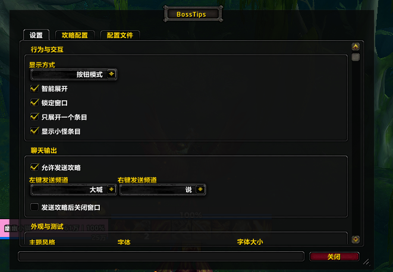
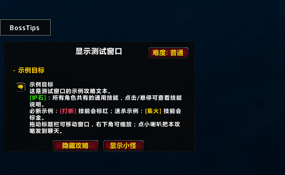
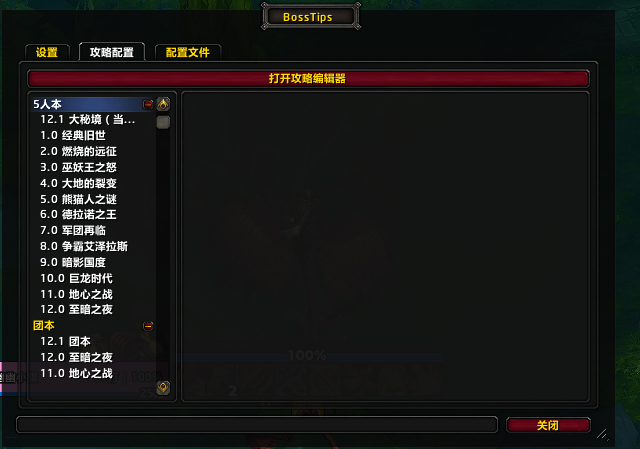
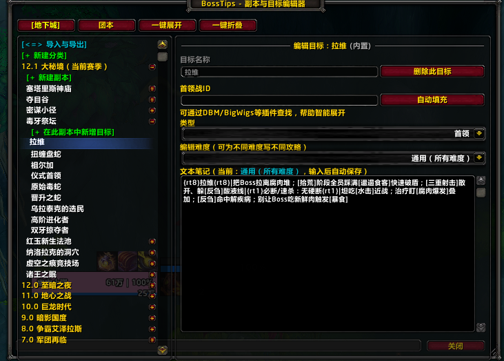
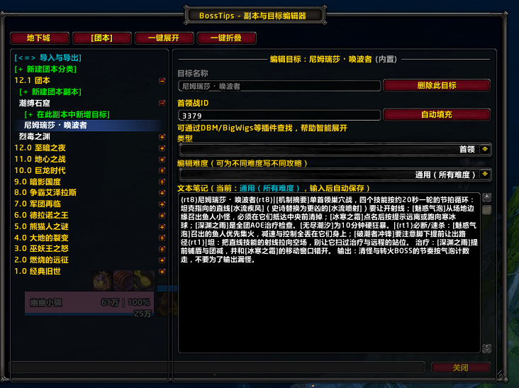

### BossTips 魔兽世界一句话攻略插件

> **当前版本：1.4.3（Ace3 架构重写版）**
>
> 内置攻略数据：原生 5 人本 **125 个**（1.0–12.0）、大秘境 Current 池 **8 本**、团本 **13 版本 439 首领**全攻略。
> 兼容 WoW Retail 12.0 / 12.1 客户端。

---

首先感谢nga_以德报德大佬的插件。我只是在其插件的基础上做了修改和完善了11版本目前的BOSS及小怪数据。

以德报德的原贴地址如下：[迟到的副本一句话攻略插件(含地心之战 8个新五人本数据、团本前4个boss数据)](https://ngabbs.com/read.php?tid=41626672)

我修改后的插件保留原作者版权及链接信息。各位也可到原作者帖子中查看，如以德报德大佬有任何问题，此贴可以删除。
之所以另开此贴还是想把这个插件重新完善并保持后续更新，因为在原作者帖子中跟帖很少有人会翻到后面去看。

---

## 📂 文件结构

```text
BossTips/
├── Ace3/                          内置 Ace3 库（离线可用，无需外部依赖）
├── Libs/                          其他内置库
├── Guides/                        攻略数据（按版本分文件，运行时自动发现）
│   ├── Dungeons/                  原生 5 人本：v1.0.lua … v18.0.lua（v13.0–v18.0 为空白占位）
│   ├── MPlus/                     大秘境：Current.lua（当前赛季池）
│   └── Raids/                     团本：v1.0.lua … v12.1.lua
├── BigWigsIdDB.lua                BigWigs 首领战 ID 数据库
├── FallbackIdDB.lua               兜底 ID 数据库
├── Core.lua                       核心逻辑
├── Data.lua                       数据层 / 发送
├── Editor.lua                     攻略编辑器
├── Settings.lua                   设置
├── Window.lua                     攻略窗口
├── Locales.lua                    本地化
├── embeds.xml                     库加载清单
├── BossTips.toc                   版本与加载清单（打包依据）
├── logo.png                       小地图图标
├── images/                        README 截图素材
├── README.md                      中文说明
├── README.en.md                   英文说明
├── CHANGELOG_CurseForge_en.md     CurseForge 更新日志（英文）
└── CurseForge_Description_en.md   CurseForge 完整介绍（英文）
```

## ✨ 核心功能

- **一句话攻略**：BOSS / 小怪的关键打断、速杀、规避机制用 `{rt1}`（星）/ `{rt8}`（骷髅）标记，扫一眼即知重点。
- **全版本覆盖**：内置 125 个原生 5 人本（1.0–12.0）、8 个大秘境当前赛季池、13 个团本版本 439 首领攻略。
- **五档难度**：LFR / 普通 / 英雄 / 史诗 / 史诗钥石；每 BOSS 可存分难度攻略，团本攻略累计式撰写（高难度含低难度）；设置可隐藏不需要的难度。
- **进本自动触发**：进入副本后聊天框附近出现 BossTips 悬浮按钮 → 匹配副本名 → 按 BOSS 弹按钮 → 点击弹攻略窗 → 一键发送到聊天。
- **内置攻略编辑器**：增删改副本/目标、分难度编辑、DBM/BigWigs 首领战 ID 自动填充、base64 导出导入（跨客户端安全）。
- **原生设置面板**：`ESC → 选项 → 插件 → BossTips`，或 `/bts set`、`/bts edit`、`/bts manage`、`/bts help`。
- **灵活发送**：可发团队/小队/说/大喊，左/右键发送频道独立配置；右键 BOSS 按钮直接发送。
- **智能匹配**：精确名 → 归一化名 → 别名 → instanceId 兜底，12.0 / 12.1（至暗之夜）稳定触发。
- **完全离线**：内置 Ace3 库，无需联网。

---

## ✨ 版本更新说明

> 从 **1.3.0** 起，插件进行了 **Ace3 架构完全重写**，从原来的"单文件 + 鼠标悬停 NPC 自动提醒"模型，改为"独立编辑器 + 按副本匹配 + 手动发送"模型，并随 **1.3.2** 把设置入口整合进游戏原生选项卡。

### 1.4.3 版本（最新）

1. **团本全量攻略**：新增 1.0–12.1 共 **13 个团本版本、439 个首领** 完整攻略，支持 LFR / 普通 / 英雄 / 史诗 / 史诗钥石 五档分难度（团本攻略累计式撰写，高难度含低难度内容）
2. **难度感知显示**：进本自动识别当前难度并显示对应难度攻略；设置新增「难度显示」开关，可关闭不需要的难度，自动切换回退到首个启用难度
3. **12.0 / 12.1（至暗之夜）内容**：新增毒渊（Venomous Abyss）团本（12.1 S2）与 12.0 原生 5 人本；新增 12.1 大秘境赛季池（8 本：4 当前轮换 + 4 旧版本重做），并入共享攻略层
4. **攻略管理器 / 编辑器**：设置树拆分 5 人本 / 团本，大秘境置顶；编辑器支持分难度编辑、DBM/BigWigs 首领战 ID 自动填充；导出导入改为纯 Lua base64（跨客户端安全），支持自定义攻略与完整配置导入导出
5. **可用性与稳定性修复**：主按钮层级降至 LOW（不再遮挡其他界面）；修复 auto 模式无可见入口问题（悬浮按钮常驻，无当前副本攻略时点击打开编辑器浏览）；右键发送频道注册修复、右键主按钮直接打开设置；修复多处加载期崩溃（局部化引用缺失、SetHyperlinksEnabled nil、FontString 超链接降级）；进本匹配增强（精确名 → 归一化名 → 别名 → instanceId 兜底）
6. **兼容性**：内置 125 个原生 5 人本（1.0–12.0）+ 8 个大秘境 Current + 13 团本版本 439 首领；适配 WoW Retail 12.0 / 12.1（`.toc` 接口 120005–120200，对 12.2 安全）；内置 Ace3 库，离线可用

### 1.3.2 版本

1. **设置窗口改为游戏原生选项卡**：通过 `ESC → 选项 → 插件 → BossTips` 直接进入设置，无需独立窗口
2. **默认发送频道改为大喊**，并可在设置栏自由切换左/右键发送频道（团队/小队/说/大喊/喊话）
3. **右键点击主按钮直接弹出设置窗口**
4. **新增 `/bts set` 命令**调出设置窗口



### 1.3.1 版本

1. 更新 **12.0 S1 赛季旧 4 本** 攻略
2. **右键点击 BOSS 按钮直接发送攻略**，无需打开攻略框体，大幅加快发送速度
3. 默认字号调整为 **14 号**（原 18 号）
4. 主按钮位置保存改为 **账号全局共享**（不再单角色保存）
5. 所有副本的 BOSS 列表按 `bossdata.lua` 中编辑的 `order` 顺序显示，可自行调整
6. 修复 12.0 S1 旧 4 本攻略无法正常发送的问题
7. 修复集合石组队情况下，大秘境 / 团本内无法正常发送攻略到聊天频道的问题

### 1.3.0 版本（重大重写）

> **重写原因**：12.0 副本内敌对 NPC 信息被加密，无法再通过鼠标悬停自动提醒 BOSS 攻略。新版本改为**匹配副本名 → 按攻略内 BOSS 数量弹出对应按钮 → 点击按钮弹出攻略框 → 一键发送** 的新交互。

1. 支持 **12.0 普通 5 人本**（等后期更新第一赛季攻略）
2. 新增 `/bts settings` 呼出设置菜单，可修改 BOSS 框体 / 攻略框体弹出方向
3. **可设置"无攻略地图自动隐藏攻略按钮"**（避免无关地图出现按钮）
4. 因按 BOSS 数量弹按钮，小怪攻略全部删除（仅保留 BOSS 打法）
5. 修复位置同步问题，多小号可共享按钮/框体位置
6. 新增 `/bts help` 查看帮助信息



---

## 📋 新旧版本功能对比

| 功能项 | 旧版（1.2.x） | 新版（1.4.3 / Ace3 重写版） |
|--------|---------------|----------------------|
| 架构 | 单文件 Lua | **Ace3 框架 + 模块化分层**（Core/Window/Settings/Editor/Data） |
| 攻略数据 | 单版本内嵌 | **按版本拆分文件** `Guides/Dungeons/vXX.lua` + `Guides/Raids/vXX.lua` + `Guides/MPlus/Current.lua` |
| 版本覆盖 | 11.0 ~ 11.2 | **1.0 ~ 12.1 全版本**（5 人本 125 个 + 团本 13 版本 439 首领） |
| 触发方式 | 鼠标悬停 NPC 自动提醒 | **匹配副本名 + 手动点击 BOSS 按钮发送** |
| 难度支持 | 无 | **LFR / 普通 / 英雄 / 史诗 / 史诗钥石** 五档 |
| 编辑器 | 直接改 `BossTips.lua` | **独立 `BossTipsGuideManager` 图形窗口**（带预览 / 难度切换 / base64 导入导出） |
| 设置入口 | `/bts settings` 命令 | **游戏原生选项卡 + `/bts set` + 右键主按钮** |
| 默认频道 | 队伍 > 团队 > 说 | **大喊**（左/右键发送频道可独立配置） |
| 字号 / 窗口位置 | 18 号 / 单角色保存 | **14 号 / 账号全局共享** |
| 隐藏攻略 | 无 | **进本自动隐藏 / 离开显示** + 无攻略地图自动隐藏 |

---

## 📸 编辑器 & 设置面板一览

游戏内通过 `/bts settings` 或 `ESC → 选项 → 插件 → BossTips` 打开设置窗口。设置窗口有三个选项卡：

| 选项卡 | 作用 |
|--------|------|
| **设置** | 显示方式、智能展开、锁定窗口、聊天频道、字体风格/大小、主题风格 |
| **攻略配置** | 按 5 人本 / 团本分类勾选启用哪些版本，隐藏个别副本 |
| **配置文件** | base64 导出/导入自定义攻略与配置 |



编辑器通过设置面板的「打开攻略编辑器」按钮或 `/bts edit` 打开，支持：

- **新增 / 重命名 / 删除** 副本与目标
- **按难度（普通 / 英雄 / 史诗 / LFR / 史诗钥石）** 分别编辑攻略
- **DBM/BigWigs 首领战 ID 自动填充**（智能展开功能依赖）
- **文本笔记**：使用 `{rt8}` `{rt1}` 标记必断/速杀技能，输入后自动保存



团本 BOSS 编辑器同样支持上述所有功能，难度档位自动按团本实际进度切换（普通→英雄→史诗→史诗钥石）。



---

## 使用方式（基于新版）

当你在副本里的时候，聊天框附近会出现 **BossTips** 悬浮按钮：

- **未匹配到副本 / 未选 BOSS**：按钮禁用，显示"无攻略"
- **左键点击主按钮**：弹出当前副本的 BOSS 列表
- **点击 BOSS 名称**：弹出攻略框体，再点击"发送"即可把攻略发到对应频道
- **右键点击 BOSS 按钮（1.3.1+）**：跳过框体，直接把该 BOSS 攻略发到设置中配置的右键频道
- **右键点击主按钮（1.3.2+）**：直接弹出设置窗口

发送频道优先级（可自定义）：团队 > 小队 > 说 > 大喊（1.3.2 默认大喊）

---

## 1.2.x 历史版本（保留记录）

### 1.2.9 版本更新
1. 添加 11.2 版本大秘境攻略数据，包括天街、宏图、生态园、赎罪大厅
2. 目前全部根据 B 站 "于笙Ace" 的视频攻略，手动整理，部分攻略存在错误或差异
3. 由于没测试服账号，目前没生态园小怪数据
4. 11.2 赛季轮换 4 个旧副本目前还是旧攻略，后期看时间情况进行更新
5. 修复了圆顶无法正确显示的 BUG

### 1.3.0 版本更新（初代重写）
1. 恢复系统默认字体，防止出现乱码 bug

### 1.2.8 版本更新
1. 添加攻略字体大小调整功能。左键点击增大字体。右键点击减小字体。默认字体 18 号，调整范围 12-32 号
2. 修复麦卡贡国王无法正确加载的问题
3. 修复部分字体下显示乱码的问题

### 1.2.7 版本更新
1. 修复暴富矿区无法正常加载的问题

### 1.2.6 版本更新
1. 增加 11.1 版本大秘境部分小怪攻略数据（暂未包含车间）
2. 11.1 版本攻略基本都是通过 B 站 UP 羽帆的视频攻略自己总结的

### 1.2.5 版本更新
1. 增加 11.1 版本大秘境攻略数据
2. 11.1 大秘境小怪部分数据需要进本实测。暂时只添加 BOSS 攻略
3. 攻略为网上收集，并未到副本进行测试

### 1.2.4 版本更新预告
1. 添加 11.1 版本大秘境及团本相关攻略数据
2. 添加地图判断功能（当处在有攻略存在的地图时显示攻略按钮）

### 1.2.3 版本更新
1. 增加按钮的移动功能，默认按钮位置在聊天框上方，上线后可以移动，移动完成会保存位置信息到 wtf 文件夹中
2. 增加攻略窗口移动功能，默认攻略窗口位置在聊天框上方
3. 增加攻略窗口大小调整功能。可以点击右下角调整窗口大小

### 1.2.3 之前的原始功能（保留）
1. 添加 11.0 版本目前所有的 5 人大米及 5 人副本的 BOSS 打发及小怪打法
2. 一句话攻略框默认设置为收起状态
3. 右键点击显示（收起/展开 3 个按钮位置一样），直接以大喊形式发送攻略
4. 展开状态左键点击发送按钮为发送到团队 > 小队 > 说频道
5. 展开状态右键点击发送按钮为发送攻略到大喊频道
6. 所有 BOSS 数据第一行添加 BOSS 或小怪名称并在两边以 `{rt8}` 骷颅头标记分割
7. 所有需要打断等其他重点技能以 `{rt1}` 星星图标标记
8. 个人展开状态，自动删除上面的 `{rt1}` `{rt8}` 等图标并将 `||` 替换为换行
9. 修改了攻略发送顺序问题，现在会按照 tips 里面的顺序挨个进行发送

---

## 🙏 致谢

感谢以下 WA 作者 / 翻译大佬 / 资料来源：

1. 艾泽拉斯制造 — [老年玩家做的大米小抄（感谢 LoRexxar 的教学视频分享）](https://bbs.nga.cn/read.php?tid=41807459&fav=:F3C48B05C)，小怪及部分 BOSS 信息参考
2. 沢田岚 — [[WA] 汉化所有大秘境 BOSS 面前一句话攻略 WA](https://bbs.nga.cn/read.php?tid=41712204&fav=:FA99311C2)，部分 BOSS 信息参考
3. Fizzle — [TWW Season 1 Dungeon Boss Strats](https://wago.io/VLiBvdxoU)，11.0 版本全英文 BOSS 一句话攻略
4. B 站 UP 主 [羽帆](https://space.bilibili.com/141341784) — 11.1 视频攻略
5. B 站 UP 主 [于笙 Ace](https://space.bilibili.com/506324721) — 11.2 视频攻略
6. 微信公众号「每日艾泽拉斯」 — 12.0 文字版攻略
7. Wowhead / Icy-Veins / 17173 — 团本首领机制与国服译名校对

---

## 📥 下载 / 反馈

- 已提交至 **CurseForge**：[https://legacy.curseforge.com/wow/addons/bosstips](https://legacy.curseforge.com/wow/addons/bosstips)
- 源码 / Issues 反馈：[https://gitee.com/fenei/BossTips](https://gitee.com/fenei/BossTips)

提交反馈格式：
```
BOSS/小怪名称-打法攻略
例如：水鼠帮劫掠者-恶臭喷吐必须打断
```

也欢迎在本贴或 NGA 原贴跟帖回复。